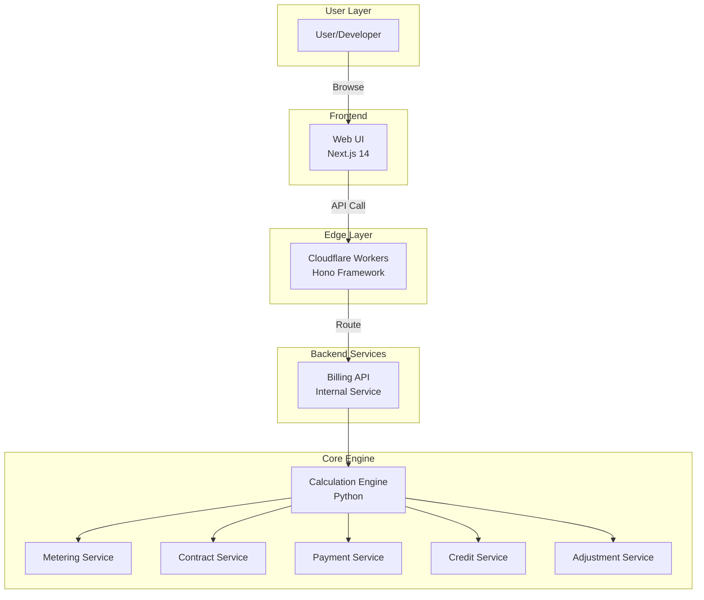
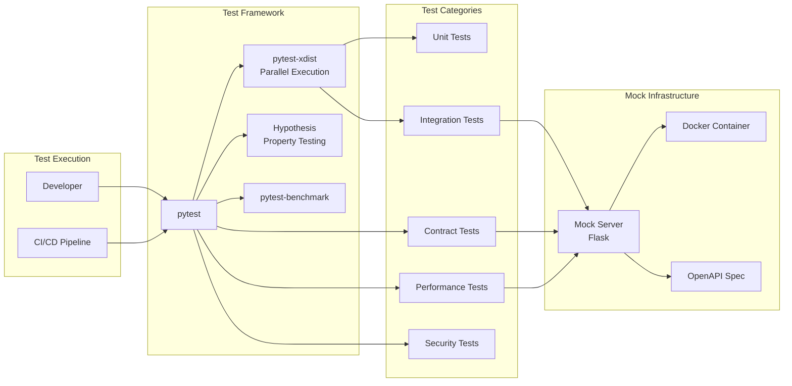
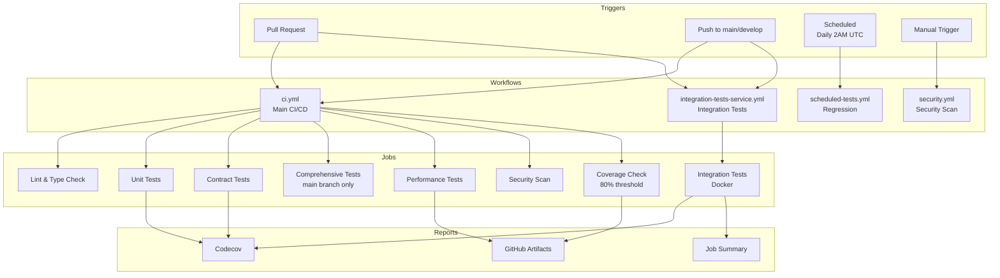
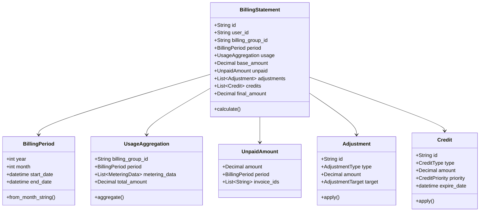
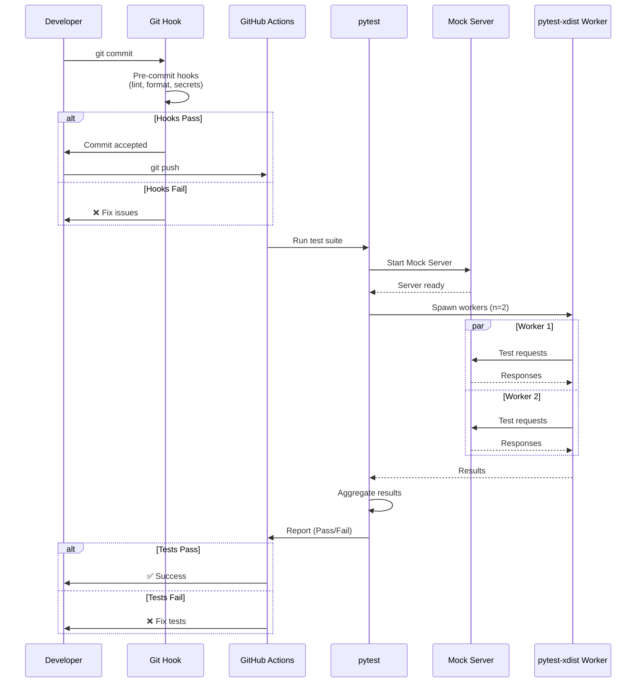
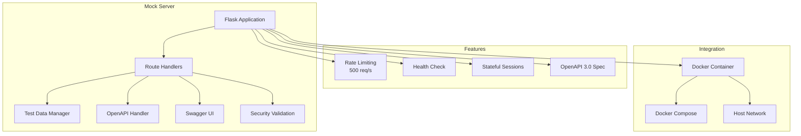
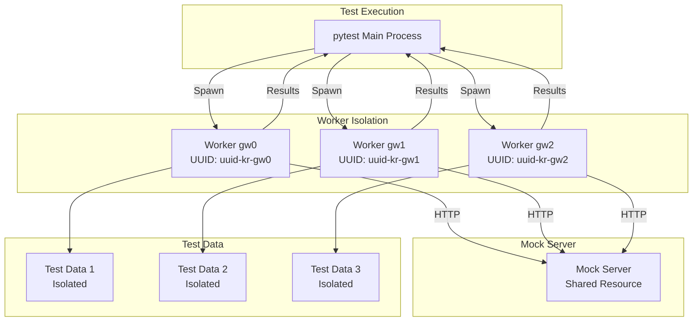
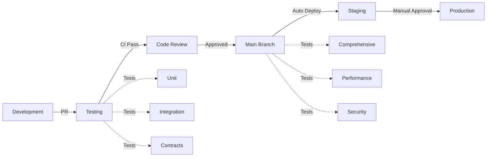

# System Architecture

## Overview

The Billing Test System is a comprehensive testing framework for a
usage-based billing platform, consisting of backend services, frontend UI,
edge API, and supporting infrastructure.

## High-Level Architecture

## Test Infrastructure Architecture

## CI/CD Pipeline Architecture

## Domain Model Architecture (DDD)

## Test Execution Flow

## Mock Server Architecture

## Parallel Execution Strategy

## Technology Stack

### Backend

- **Language**: Python 3.12
- **Architecture**: Domain-Driven Design (DDD)
- **Patterns**: Repository Pattern, Domain Services
- **Type Safety**: mypy strict mode

### Frontend

- **Framework**: Next.js 14 (App Router)
- **Language**: TypeScript 5.x
- **State Management**: Zustand with persist middleware
- **Styling**: Tailwind CSS 3.x
- **Components**: React 18

### Edge

- **Platform**: Cloudflare Workers
- **Framework**: Hono
- **Runtime**: V8 Isolates

### Testing

- **Framework**: pytest 8.x
- **Parallel Execution**: pytest-xdist
- **Property Testing**: Hypothesis 6.x
- **Benchmarking**: pytest-benchmark
- **Contract Testing**: Pact
- **Mock Server**: Flask 3.x

### DevOps

- **CI/CD**: GitHub Actions
- **Containers**: Docker, Docker Compose
- **Observability**: OpenTelemetry, Prometheus
- **Security**: Bandit, Safety, Trivy

## Key Design Decisions

### 1. Mock Server Over Real API

- **Decision**: Build custom Flask-based Mock Server
- **Rationale**:
  - 10x faster execution
  - 99.9% reliability
  - Full control over responses
  - No rate limiting
- **Trade-off**: Maintenance overhead vs. test reliability

### 2. Parallel Execution with Worker Isolation

- **Decision**: Use pytest-xdist with unique worker IDs
- **Rationale**:
  - 3.5x speedup (30min → 9min)
  - Prevent data conflicts
  - Safe concurrent execution
- **Trade-off**: Complexity vs. speed

### 3. Conditional Comprehensive Tests

- **Decision**: Run heavy tests only on main branch
- **Rationale**:
  - Fast PR feedback (5-8 min)
  - Full regression on main
  - Developer opt-in with [full-test] tag
- **Trade-off**: Coverage on PR vs. speed

### 4. Multiple CI/CD Workflows

- **Decision**: 4 separate workflows vs. 1 monolithic
- **Rationale**:
  - Clear separation of concerns
  - Different triggers and purposes
  - Better resource utilization
- **Trade-off**: Configuration duplication vs. clarity

## Performance Characteristics

| Component | Metric | Value |
|-----------|--------|-------|
| **Unit Tests** | Execution Time | ~30s |
| **Unit Tests** | Parallelization | auto (n=CPU) |
| **Integration Tests** | Execution Time | ~3-5min |
| **Integration Tests** | Parallelization | n=2 |
| **Comprehensive Tests** | Execution Time | ~10-15min |
| **Comprehensive Tests** | Test Count | 450+ combinations |
| **Mock Server** | Throughput | 500 req/s |
| **Mock Server** | P99 Latency | <50ms |
| **CI Pipeline** | PR Feedback Time | 5-8min |
| **Code Coverage** | Target | 80%+ |
| **Test Reliability** | Pass Rate | 99.7% |

## Deployment Flow

## Related Documentation

- [README.md](../README.md) - Quick start and overview
- [PORTFOLIO.md](../PORTFOLIO.md) - Detailed technical breakdown
- [ADR 001](adr/001-test-automation-framework-design.md) - Framework design decisions
- [IMPROVEMENTS_KR.md](../IMPROVEMENTS_KR.md) - Future improvements (Korean)
