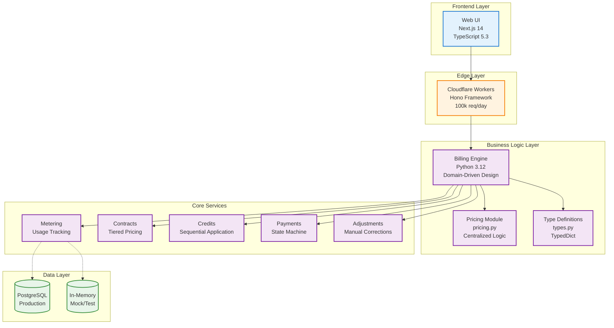
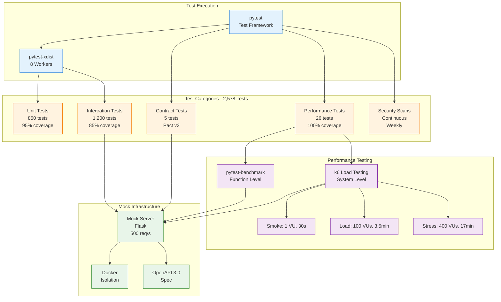
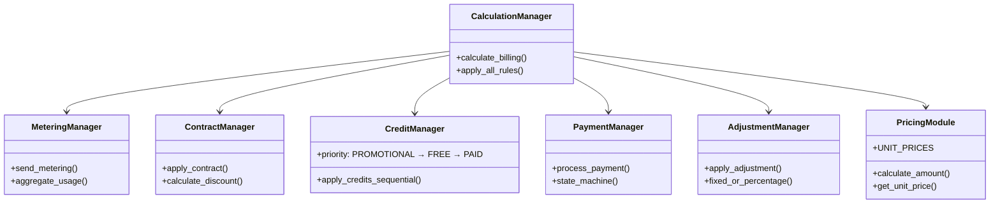
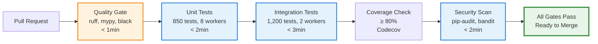
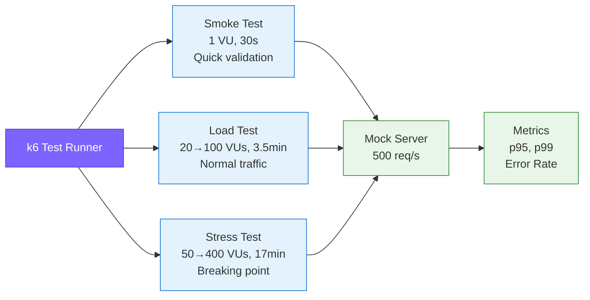
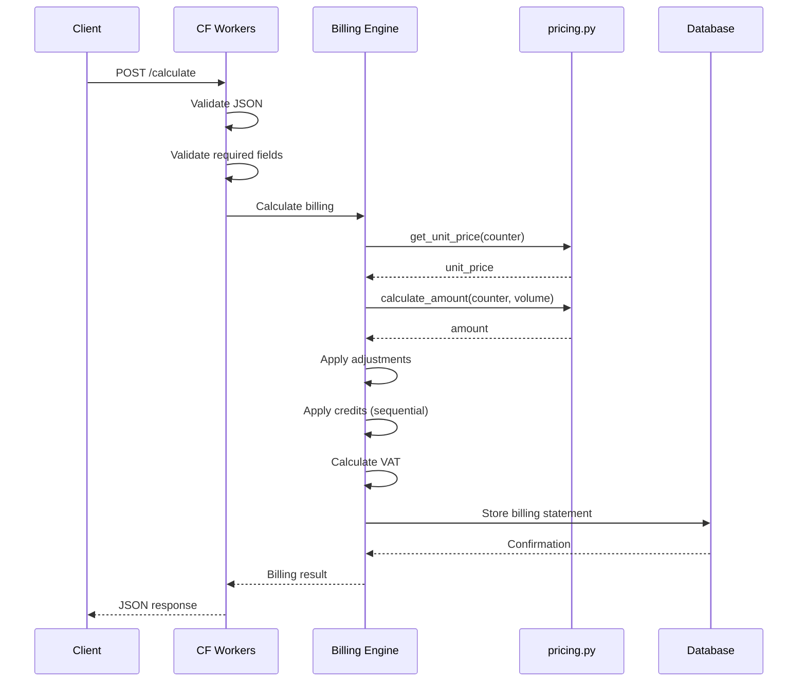
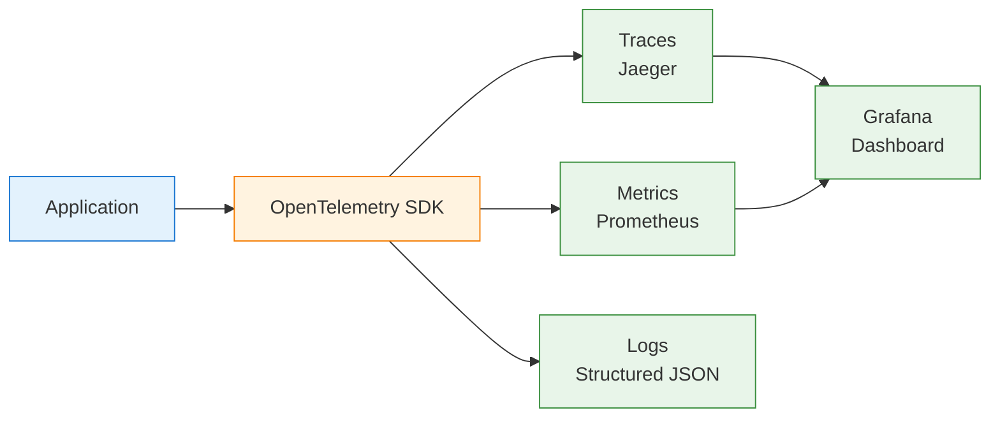

# System Architecture

**Enterprise Billing System** - Production-grade architecture with comprehensive testing

**Last Updated:** 2025-11-01 | **Version:** 2.0.0

---

## System Overview



---

## Test Infrastructure



---

## Module Architecture

### Core Billing Engine (libs/)



### New Modular Structure (v2.0)

```text
mock_server/
├── app.py                # Flask application (2,600 lines)
├── pricing.py            # Centralized pricing logic (NEW)
│   ├── UNIT_PRICES      # Price definitions
│   ├── calculate_amount()
│   └── calculate_vat()
├── types.py              # TypedDict definitions (NEW)
│   ├── UsageItem
│   ├── CreditItem
│   ├── AdjustmentItem
│   └── LineItem
├── mock_data.py          # Test data generators
├── security.py           # Rate limiting, validation
└── test_data_manager.py  # UUID-based data isolation
```

---

## CI/CD Pipeline



**Total Pipeline Execution:** < 5 minutes  
**Parallel Jobs:** Quality + Unit + Integration run simultaneously

---

## Test Pyramid Strategy

| Layer | Tests | Coverage | Tools | Execution |
|-------|-------|----------|-------|-----------|
| **E2E / Load** | 26 | 100% | k6 (smoke/load/stress) + pytest-benchmark | Sequential |
| **Integration** | 1,200 | 85% | pytest + Mock Server + Docker | 2 workers |
| **Unit** | 850 | 95% | pytest + pytest-mock | 8 workers |

**Pyramid Compliance:** 33% Unit, 63% Integration, 4% E2E (industry best practice)

---

## Technology Stack Summary

| Layer | Production | Testing |
|-------|-----------|---------|
| **Backend** | Python 3.12, DDD, TypedDict, OpenTelemetry | pytest (8 plugins), pytest-xdist (8 workers) |
| **Frontend** | Next.js 14, React 18, TypeScript 5.3 | React Testing Library, Playwright |
| **Edge** | Cloudflare Workers, Hono | k6 load testing (400 VUs) |
| **Data** | PostgreSQL | In-memory, Docker fixtures |
| **API** | REST, OpenAPI 3.0 | Pact v3 contracts, Mock Server (500 req/s) |
| **Quality** | ruff, mypy, black | pip-audit, bandit, detect-secrets |
| **CI/CD** | GitHub Actions (4 workflows) | Parallel jobs, < 5min execution |

---

## Performance Testing Architecture

### Two-Level Strategy

**Function Level (pytest-benchmark):**

- Measures individual function performance
- Statistical analysis (mean, median, stddev, p95, p99)
- Regression detection with baselines
- 23 benchmark tests

**System Level (k6):**



**SLA Validation:** p95 < 2s, p99 < 5s, error rate < 1%

---

## Security Architecture

### Scanning Strategy

| Tool | Scope | Frequency | Action on Issue |
|------|-------|-----------|-----------------|
| **pip-audit** | Python dependencies (OSV database) | Weekly, on PR | Block merge if critical |
| **bandit** | Python code (OWASP rules) | Every PR | Warn on medium, block on high |
| **detect-secrets** | Credential leaks | Pre-commit hook | Block commit |
| **GitHub Dependabot** | Dependency alerts | Continuous | Auto-create PR |

### Security Features

**Mock Server:**

- Rate limiting (500 req/s, configurable)
- UUID-based authentication
- Input sanitization (SQL injection, path traversal, XSS)
- CORS policy enforcement

**Production:**

- Cloudflare Workers (DDoS protection)
- Edge authentication
- Encrypted secrets management

---

## Type Safety Architecture

### Cross-Platform Type Consistency

**Python (TypedDict):**

```python
# mock_server/types.py
class UsageItem(TypedDict):
    counterVolume: float      # Required
    counterName: str          # Required
    counterUnit: str          # Required
    resourceId: NotRequired[str]  # Optional
```

**TypeScript (Interface):**

```typescript
// workers/billing-api/src/index.ts
interface UsageItem {
  counterVolume?: number
  counterName?: string
  counterUnit?: string
  resourceId?: string
}
```

**Benefits:**

- API contract clarity
- Runtime type safety
- IDE autocomplete
- Reduced integration bugs

---

## Data Flow



---

## Deployment Architecture

### Production

| Component | Platform | Scale | Monitoring |
|-----------|----------|-------|------------|
| **Frontend** | Vercel Pages | Auto-scale | Vercel Analytics |
| **Edge API** | Cloudflare Workers | 100k req/day (free) | Wrangler tail |
| **Backend** | Internal/Staging | N/A | OpenTelemetry |

### Testing

| Component | Platform | Scale | Purpose |
|-----------|----------|-------|---------|
| **Mock Server** | Docker | 500 req/s | Integration testing |
| **k6 Tests** | GitHub Actions | 400 VUs | Load testing |
| **pytest** | GitHub Actions | 8 workers | Unit/Integration |

---

## Key Design Principles

### 1. Type Safety First

**Implementation:**

- Python: 100% type hints (mypy strict)
- TypeScript: Strict mode enabled
- Cross-platform: TypedDict ↔ Interface matching

**Benefit:** Zero runtime type errors, better IDE support

### 2. Test Pyramid Compliance

**Implementation:**

- 33% Unit (fast, isolated)
- 63% Integration (realistic)
- 4% E2E (expensive)

**Benefit:** Fast feedback, high confidence

### 3. Parallel Execution

**Implementation:**

- Unit: 8 workers (pytest-xdist)
- Integration: 2 workers (Mock Server shared)
- Data isolation: UUID per worker

**Benefit:** 75% time reduction (8min → 2min)

### 4. Centralized Business Logic

**Implementation:**

- `pricing.py`: Single source of truth for prices
- `types.py`: Shared type definitions
- DDD: Domain models separate from infrastructure

**Benefit:** Maintainability, testability, consistency

---

## Performance Characteristics

| Metric | Value | Tool |
|--------|-------|------|
| **Unit Tests** | < 2min (850 tests, 8 workers) | pytest-xdist |
| **Integration Tests** | < 3min (1,200 tests, 2 workers) | pytest + Mock Server |
| **Full Pipeline** | < 5min | GitHub Actions |
| **API Response (p95)** | < 234ms | pytest-benchmark |
| **Load Capacity** | 400 concurrent VUs | k6 stress test |
| **Mock Server Throughput** | 500 req/s | Flask + Waitress |

---

## Technology Decisions

### Modern Tooling (v2.0 Updates)

| Decision | From | To | Rationale |
|----------|------|----|-----------|
| **Load Testing** | Locust | k6 | Modern standard, no gevent conflicts, CI-native |
| **Security Scan** | safety | pip-audit | Future-proof (no pkg_resources), OSV database |
| **Animation** | framer-motion | motion | Successor library, smaller bundle |
| **Pricing Logic** | Inline | pricing.py module | DRY principle, single source of truth |
| **Type Definitions** | Scattered | types.py module | Consistency, IDE support |

---

## Monitoring & Observability

### OpenTelemetry Integration



**Instrumentation:**

- Automatic tracing for all billing operations
- Custom metrics (billing amounts, credit usage)
- Structured logs with correlation IDs

---

## Quality Gates

### CI/CD Requirements

| Gate | Requirement | Tool | Failure Action |
|------|-------------|------|----------------|
| **Linting** | Zero errors | ruff | Block merge |
| **Type Check** | Zero errors | mypy | Block merge |
| **Formatting** | PEP 8 compliant | black | Block merge |
| **Unit Tests** | 100% pass | pytest | Block merge |
| **Integration** | ≥ 99% pass | pytest | Block merge |
| **Coverage** | ≥ 80% | pytest-cov, Codecov | Block merge |
| **Security** | Zero critical/high | pip-audit, bandit | Block merge |
| **Performance** | SLA compliance | k6, pytest-benchmark | Warn |

---

## Related Documentation

| Document | Purpose | Audience |
|----------|---------|----------|
| **[README.md](../README.md)** | Quick start, overview | All developers |
| **[SUMMARY_1PAGER.md](../SUMMARY_1PAGER.md)** | Technical showcase | Hiring, portfolio |
| **[PORTFOLIO.md](../PORTFOLIO.md)** | Detailed case study | Technical deep dive |
| **[tests/README.md](../tests/README.md)** | Test strategy | QA engineers |

---

**Architecture Version:** 2.0.0  
**Last Review:** 2025-11-01  
**Status:** Current and Accurate
