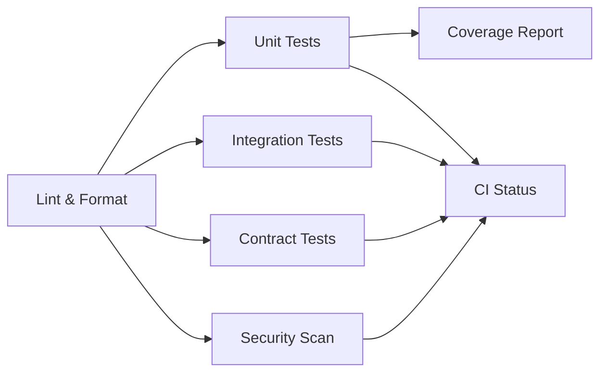

# CI/CD Architecture

## Overview

The CI/CD system has been simplified to focus on three main workflows:

1. **ci.yml** - Main CI pipeline for PRs and pushes
2. **scheduled-tests.yml** - Comprehensive daily test runs
3. **security.yml** - Security scanning (on-demand and weekly)

## Main CI Pipeline (`ci.yml`)

Runs on every push and PR to main/develop branches.



### Jobs:
- **lint**: Code quality checks (fast fail)
- **test**: Parallel test execution (unit, integration, contracts)
- **security**: Basic security scan
- **coverage**: Code coverage report
- **status**: Final status check

## Scheduled Tests (`scheduled-tests.yml`)

Daily comprehensive test runs at 2 AM UTC.

### Test Matrix:
- Members: kr, jp, etc
- Months: current, previous
- Full test suite with coverage

### Additional Tests:
- Performance benchmarks
- Comprehensive security scan
- Test summary report

## Security Workflow (`security.yml`)

Weekly security scans and PR security checks.

### Scans:
- Bandit (code security)
- Safety (dependency vulnerabilities)
- Secret detection
- CodeQL SAST analysis

## Test Execution

### Docker-based (Default)
```bash
# Run all tests
make test

# Run specific tests
make test-unit
make test-integration
make test-contracts

# With coverage
make test-coverage
```

### Local Execution
```bash
# Run locally without Docker
make test-local
make test-local-unit
```

## Key Features

1. **Parallel Execution**: Tests run in parallel for faster feedback
2. **Docker Integration**: Consistent test environment
3. **Coverage Tracking**: Automatic coverage reports
4. **Security First**: Integrated security scanning
5. **Flexible Execution**: Support for both Docker and local runs

## Environment Variables

- `DOCKER_BUILD_NO_CACHE`: Force Docker image rebuild
- `POETRY_VERSION`: Poetry version (2.2.1)
- `PYTHON_VERSION`: Python version (3.12)

## Maintenance

### Adding New Test Categories
1. Update `scripts/run_tests.py` to support new category
2. Add to CI matrix in `.github/workflows/ci.yml`
3. Update Makefile targets

### Updating Dependencies
1. Update `requirements.txt` or `pyproject.toml`
2. CI automatically rebuilds on push events
3. Use `make docker-build-no-cache` for local forced rebuild
