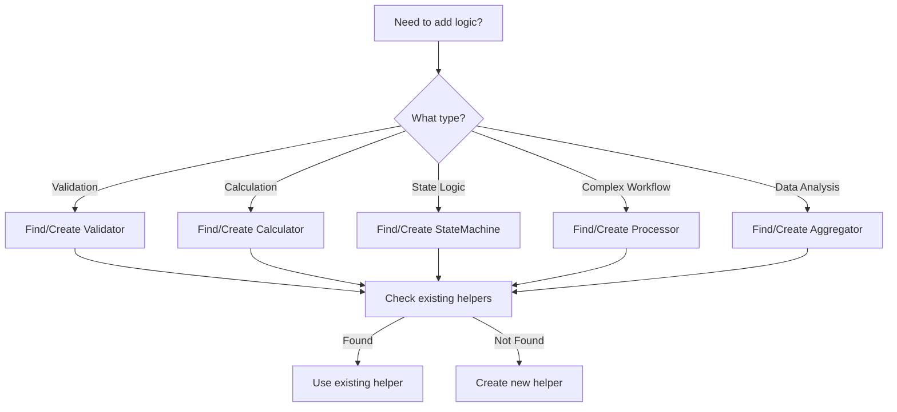

# Helper Classes Quick Reference

## 📋 Quick Lookup Table

| Helper Class | Purpose | Key Methods | Location |
|--------------|---------|-------------|----------|
| **PaymentValidator** | Payment validation | `validate_month_format()`, `validate_amount()` | `libs/Payments.py` |
| **PaymentStateMachine** | Payment state transitions | `can_transition()`, `get_transition_path()` | `libs/payment_state_machine.py` |
| **PaymentProcessor** | Payment processing workflows | `calculate_processing_fee()`, `batch_reconcile()` | `libs/payment_processor.py` |
| **CreditCalculator** | Credit calculations | `validate_credit_amount()`, `calculate_total_from_history()` | `libs/Credit.py` |
| **BatchValidator** | Batch job validation | `validate_job_code()`, `validate_execution_day()` | `libs/batch_validator.py` |
| **ContractValidator** | Contract validation | `validate_contract_id()`, `validate_date_range()` | `libs/contract_validator.py` |
| **AdjustmentCalculator** | Adjustment calculations | `calculate_adjustment()`, `validate_adjustment_amount()` | `libs/adjustment_calculator.py` |
| **MeteringCalculator** | Metering calculations | `convert_units()`, `aggregate_usage()` | `libs/metering_calculator.py` |
| **MeteringAggregator** | Metering aggregation | `aggregate_by_dimensions()`, `create_usage_summary()` | `libs/metering_aggregator.py` |
| **BillingCalculator** | Billing calculations | `calculate_invoice_total()`, `calculate_tiered_pricing()` | `libs/billing_calculator.py` |

## 🚀 Common Usage Patterns

### Validation Pattern
```python
# Import validator
from libs.Payments import PaymentValidator
from libs.exceptions import ValidationException

# Use in manager
try:
    PaymentValidator.validate_month_format("2024-01")
    PaymentValidator.validate_amount(amount)
except ValidationException as e:
    # Handle validation error
    return {"error": str(e)}
```

### Calculation Pattern
```python
# Import calculator
from libs.billing_calculator import BillingCalculator
from decimal import Decimal

# Calculate with type safety
discount = BillingCalculator.calculate_discount(
    base_amount=Decimal("1000"),
    discount=discount_obj
)
```

### State Machine Pattern
```python
# Import state machine
from libs.payment_state_machine import PaymentStateMachine
from libs.constants import PaymentStatus

# Check transitions
if PaymentStateMachine.can_transition(current, target):
    # Perform transition
    payment.status = target
```

### Aggregation Pattern
```python
# Import aggregator
from libs.metering_aggregator import MeteringAggregator

# Aggregate data
summary = MeteringAggregator.create_usage_summary(metering_data)
by_app = MeteringAggregator.aggregate_by_dimensions(
    metering_data, 
    dimensions=["appKey"]
)
```

## 🧪 Testing Patterns

### Unit Test Pattern
```python
# Test pure functions directly
def test_validate_amount():
    # No mocking needed!
    PaymentValidator.validate_amount(Decimal("100"))
    
    with pytest.raises(ValidationException):
        PaymentValidator.validate_amount(Decimal("-100"))
```

### Property-Based Testing
```python
# Use Hypothesis for calculators
from hypothesis import given, strategies as st

@given(
    amount=st.decimals(min_value=0, max_value=1000000),
    rate=st.decimals(min_value=0, max_value=100)
)
def test_calculate_percentage(amount, rate):
    result = Calculator.calculate_percentage(amount, rate)
    assert 0 <= result <= amount
```

## 🔧 When to Create New Helpers

### ✅ Good Candidates
- Pure validation logic
- Mathematical calculations
- Data transformations
- State transition rules
- Formatting/parsing logic
- Aggregation algorithms

### ❌ Not Suitable
- API communication
- Database operations
- External service calls
- Stateful operations
- UI/presentation logic

## 📝 Naming Conventions

| Type | Pattern | Example |
|------|---------|---------|
| **Validators** | `{Entity}Validator` | `PaymentValidator`, `ContractValidator` |
| **Calculators** | `{Domain}Calculator` | `BillingCalculator`, `CreditCalculator` |
| **State Machines** | `{Entity}StateMachine` | `PaymentStateMachine` |
| **Processors** | `{Domain}Processor` | `PaymentProcessor` |
| **Aggregators** | `{Data}Aggregator` | `MeteringAggregator` |

## 🎯 Best Practices Checklist

- [ ] **Pure Functions**: No side effects, deterministic
- [ ] **Type Hints**: Use typing for all parameters and returns
- [ ] **Error Handling**: Raise specific exceptions (ValidationException, CalculationException)
- [ ] **Documentation**: Include docstrings with examples
- [ ] **Unit Tests**: 100% coverage for helper methods
- [ ] **Class Methods**: Use `@classmethod` for stateless helpers
- [ ] **Constants**: Define magic numbers as class constants
- [ ] **Decimal Usage**: Use `Decimal` for monetary calculations

## 🔍 Finding the Right Helper



## 💡 Pro Tips

1. **Composition over Inheritance**: Helpers are stateless utilities
2. **Single Responsibility**: Each helper should do one thing well
3. **Immutability**: Return new values, don't modify inputs
4. **Caching**: Use `@lru_cache` for expensive pure calculations
5. **Batch Operations**: Provide batch methods for performance

## 📚 Examples by Use Case

### Financial Calculations
```python
from libs.billing_calculator import BillingCalculator

# Tiered pricing
price = BillingCalculator.calculate_tiered_pricing(
    quantity=Decimal("100"),
    tier_rules=pricing_tiers
)

# Proration
prorated = BillingCalculator.calculate_proration(
    full_amount=Decimal("30000"),
    days_used=15,
    days_in_period=30
)
```

### Data Validation
```python
from libs.contract_validator import ContractValidator

# Validate date range
ContractValidator.validate_date_range(
    start_date="2024-01-01",
    end_date="2024-12-31"
)

# Validate transitions
ContractValidator.validate_status_transition(
    from_status=ContractStatus.DRAFT,
    to_status=ContractStatus.ACTIVE
)
```

### Metrics & Analytics
```python
from libs.metering_aggregator import MeteringAggregator

# Time-based aggregation
hourly = MeteringAggregator.aggregate_by_time_bucket(
    metering_data,
    bucket_size="hour"
)

# Anomaly detection
outliers = MeteringAggregator.detect_outliers(
    metering_data,
    threshold=2.0  # 2 standard deviations
)
```

## 🚨 Common Pitfalls to Avoid

1. **Don't add state to helpers** - Keep them stateless
2. **Don't make external calls** - No API/DB operations
3. **Don't use global variables** - Pass all dependencies
4. **Don't mutate inputs** - Return new values
5. **Don't mix concerns** - One helper, one purpose

## 📞 Getting Help

- Review `docs/helper_classes_guide.md` for detailed architecture
- Check unit tests for usage examples
- Use type hints for IDE autocomplete
- Run `pytest tests/unit/test_{helper_name}.py` to see examples
